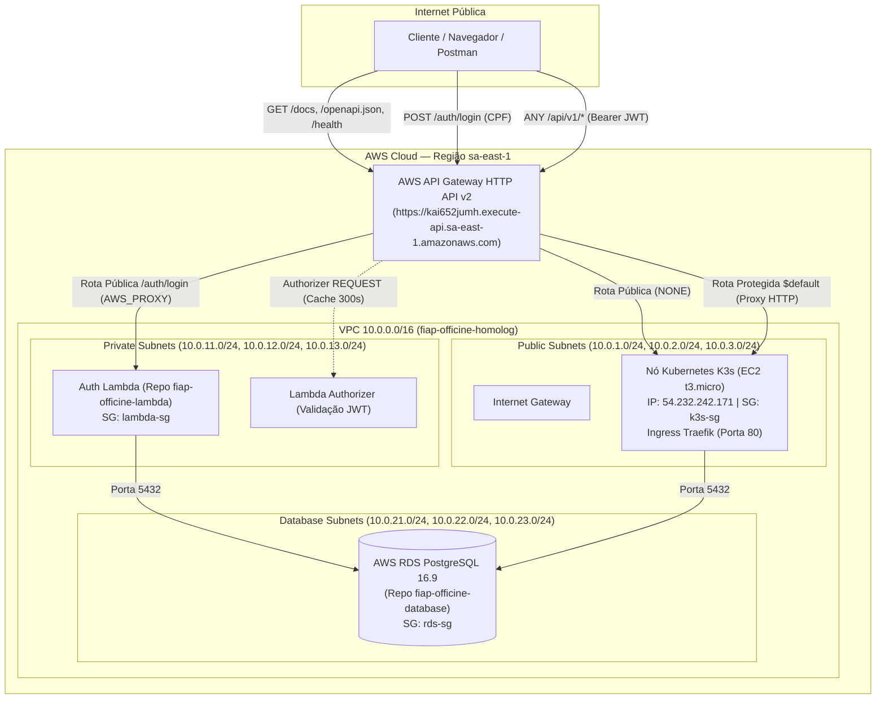

# ☸️ fiap-officine-kubernets — Infraestrutura Base AWS, Kubernetes & API Gateway

**Tech Challenge FIAP (15SOAT)**  
Repositório responsável pelo provisionamento e gerenciamento da **Infraestrutura Base na AWS** via **Terraform** para o ecossistema **fiap-officine**. Atua como a fundação de rede, segurança e orquestração de microsserviços de toda a plataforma.

---

## 🎯 Propósito do Repositório

O **fiap-officine-kubernets** gerencia e automatiza a infraestrutura de nuvem na AWS:
* **Rede Isolada (VPC Multi-AZ)**: Provisionamento de subnets Públicas, Privadas e de Banco de Dados distribuídas entre 3 zonas de disponibilidade (`sa-east-1a`, `sa-east-1b`, `sa-east-1c`).
* **Segurança de Borda (Security Groups)**: Regras estritas de firewall isolando o RDS PostgreSQL, a Function Serverless (Lambda), os nós do Kubernetes e o API Gateway.
* **Orquestração de Microsserviços**: Provisionamento de nó Kubernetes **K3s (Free Tier)** para homologação e **Amazon EKS** para produção.
* **Ponto Único de Entrada (AWS API Gateway HTTP API v2)**:
  - Rotas públicas abertas para visualização e observabilidade (`/docs`, `/openapi.json`, `/redoc`, `/health`, `/api/v1/health`).
  - Rota de autenticação serverless (`/auth/login`).
  - Proteção de todas as rotas de negócio (`$default`) via **Lambda Authorizer** com validação de JWT.

---

## 🏗️ Diagrama da Arquitetura do Repositório



---

## 🚀 Tecnologias Utilizadas

| Tecnologia | Uso |
| :--- | :--- |
| **Terraform 1.9+** | Infraestrutura como Código (IaC) modular e reutilizável |
| **AWS API Gateway (HTTP API v2)** | Gateway gerenciado de baixa latência, suporte nativo a CORS e Lambda Authorizer |
| **AWS VPC & Security Groups** | Arquitetura de rede isolada em 3 AZs com subnets públicas, privadas e de dados |
| **K3s (Lightweight Kubernetes)** | Orquestrador Kubernetes leve e 100% elegível ao Free Tier para homologação |
| **Amazon EKS** | Orquestrador Kubernetes gerenciado para ambientes produtivos de alta escala |
| **Traefik Ingress Controller** | Ingress controller integrado nativamente ao nó K3s para proxy reverso |
| **AWS Systems Manager (SSM)** | Acesso shell seguro aos nós sem portas SSH expostas ou necessidade de chaves `.pem` |
| **GitHub Actions** | Validação sintática, formatação, planejamento e deploy contínuo |

---

## 📡 Documentação das APIs (Swagger & Postman)

O API Gateway provisionado por este repositório expõe diretamente os seguintes endpoints públicos para visualização e testes:

* **Swagger UI (Documentação Interativa)**:  
  👉 [https://kai652jumh.execute-api.sa-east-1.amazonaws.com/docs](https://kai652jumh.execute-api.sa-east-1.amazonaws.com/docs)
* **ReDoc (Documentação Técnica)**:  
  👉 [https://kai652jumh.execute-api.sa-east-1.amazonaws.com/redoc](https://kai652jumh.execute-api.sa-east-1.amazonaws.com/redoc)
* **Contrato OpenAPI JSON (Postman / Swagger Editor)**:  
  👉 [https://kai652jumh.execute-api.sa-east-1.amazonaws.com/openapi.json](https://kai652jumh.execute-api.sa-east-1.amazonaws.com/openapi.json)
* **Healthcheck de Uptime**:  
  👉 [https://kai652jumh.execute-api.sa-east-1.amazonaws.com/health](https://kai652jumh.execute-api.sa-east-1.amazonaws.com/health)
* **Healthcheck Detalhado (DB + Cache)**:  
  👉 [https://kai652jumh.execute-api.sa-east-1.amazonaws.com/api/v1/health](https://kai652jumh.execute-api.sa-east-1.amazonaws.com/api/v1/health)

---

## 🛠️ Estrutura de Módulos Terraform

```
fiap-officine-kubernets/
├── terraform/
│   ├── modules/
│   │   ├── vpc/                      # VPC, Subnets Públicas/Privadas/Database, IGW e Route Tables
│   │   ├── security_groups/          # Security Groups: alb, k3s, lambda, rds
│   │   ├── k3s/                      # Nó EC2 K3s Free Tier (t3.micro) com 2GB Swap e SSM
│   │   ├── eks/                      # Cluster EKS Gerenciado (para Produção)
│   │   └── api_gateway/              # HTTP API v2 com rotas públicas (/docs, /health) e Authorizer
│   └── environments/
│       ├── homolog/                  # Ambiente 100% Free Tier ($0 de custo fixo)
│       └── production/               # Ambiente Multi-AZ com EKS
└── .github/workflows/
    └── terraform.yml                 # Pipeline CI/CD com validação, plan e apply
```

---

## 💰 Comparativo de Ambientes

| Componente | Homologação (100% Free Tier) | Produção (Alta Disponibilidade) |
| :--- | :--- | :--- |
| **Orquestrador K8s** | **K3s em EC2 `t3.micro`** ($0.00 / 750h mês) | **AWS EKS Gerenciado** (Multi-AZ) |
| **NAT Gateway** | **Desabilitado ($0 custo)** | 2 a 3 NAT Gateways redundantes |
| **API Gateway** | **HTTP API v2** (1 milhão req/mês grátis) | HTTP API v2 com CloudFront / Custom Domain |
| **Conexão Shell** | **AWS SSM Session Manager** (Zero chave SSH) | AWS SSM Session Manager com auditoria IAM |
| **Custo Fixo Estimado** | **$0.00 / mês** | ~$80 a $150 / mês |

---

## 🚀 Como Executar e Aplicar a Infraestrutura

### 1. Inicializar e Planejar Homologação:
```bash
cd terraform/environments/homolog
terraform init
terraform plan
```

### 2. Aplicar as Alterações na AWS:
```bash
terraform apply -auto-approve
```

### 3. Conectar ao Terminal do Nó Kubernetes via AWS SSM (Sem Chave SSH):
```bash
aws ssm start-session --target i-0484adf59b70f850f --region sa-east-1
```

---

## 🛰️ Recursos Ativos em Homologação (AWS sa-east-1)

* **VPC ID**: `vpc-074f1e84d85d2f999`
* **API Gateway ID**: `kai652jumh`
* **URL Pública do API Gateway**: `https://kai652jumh.execute-api.sa-east-1.amazonaws.com`
* **Instância K3s**: `i-0484adf59b70f850f` (IP: `54.232.242.171`)
* **Security Group da Lambda**: `sg-099bc9a0635f1d4a6`
* **Security Group do RDS**: `sg-0faf87d7a9a816a46`

---

## 🔒 Governança de Branches
* **Branch `main` e `develop` protegidas** contra commits diretos.
* **Obrigatório uso de Pull Requests** com validação compulsória de `terraform fmt`, `terraform validate` e `terraform plan`.
* **Deploy contínuo**: Merge em `develop` ➔ Deploy em Homologação; Merge em `main` ➔ Deploy em Produção.