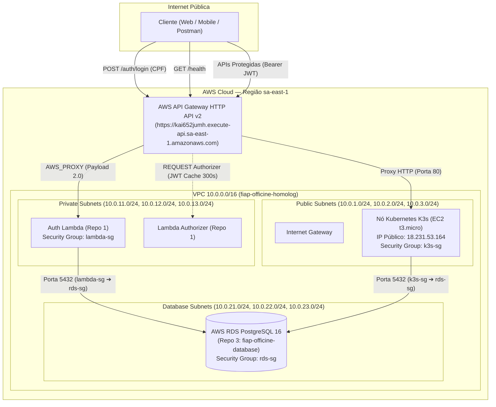

# ☸️ fiap-officine-kubernets — Infraestrutura Base AWS & Kubernetes

Repositório responsável pelo provisionamento e gerenciamento da **Infraestrutura Base na AWS** via **Terraform** para o ecossistema **fiap-officine** (Tech Challenge FIAP).

---

## 📑 Sumário

1. [Visão Geral](#-visão-geral)
2. [Arquitetura de Rede e Componentes](#-arquitetura-de-rede-e-componentes)
3. [Estrutura de Módulos Terraform](#-estrutura-de-módulos-terraform)
4. [Especificação dos Ambientes (Homologação vs Produção)](#-especificação-dos-ambientes)
5. [Recursos Ativos em Homologação (Free Tier)](#-recursos-ativos-em-homologação-free-tier)
6. [Pipeline de CI/CD e Governança de Branches](#-pipeline-de-cicd-e-governança-de-branches)
7. [Como Executar Localmente](#-como-executar-localmente)

---

## 🎯 Visão Geral

Este repositório atua como a **espinha dorsal de rede e orquestração** de toda a plataforma:
* **Rede Isolada (VPC Multi-AZ)**: Provisiona subnets Públicas, Privadas e de Banco de Dados distribuídas entre 3 zonas de disponibilidade (`sa-east-1a`, `sa-east-1b`, `sa-east-1c`).
* **Segurança de Borda (Security Groups)**: Regras estritas de firewall isolando o RDS PostgreSQL, a Function Serverless (Lambda), o nó Kubernetes e o API Gateway.
* **Orquestração de Microsserviços**: Provisiona nó Kubernetes **K3s (Free Tier)** para homologação e **Amazon EKS** para produção.
* **Ponto Único de Entrada**: **AWS API Gateway HTTP API v2** com roteamento direto para a Function Serverless (`/auth/login`) e proteção das rotas de microsserviços via *Lambda Authorizer*.

---

## 🏛️ Arquitetura de Rede e Componentes



---

## 📁 Estrutura de Módulos Terraform

```
fiap-officine-kubernets/
├── terraform/
│   ├── modules/
│   │   ├── vpc/                      # VPC, Subnets Públicas/Privadas/Database, IGW e Route Tables
│   │   ├── security_groups/          # Security Groups: alb, eks_nodes, lambda, rds
│   │   ├── k3s/                      # Nó EC2 K3s Free Tier (t3.micro) com 2GB Swap e SSM
│   │   ├── eks/                      # Cluster EKS Gerenciado (para Produção)
│   │   └── api_gateway/              # HTTP API v2 com rotas /auth/login e Lambda Authorizer
│   └── environments/
│       ├── homolog/                  # Ambiente 100% Free Tier ($0 de custo fixo)
│       │   ├── main.tf
│       │   ├── variables.tf
│       │   ├── outputs.tf
│       │   └── terraform.tfvars
│       └── production/               # Ambiente de Alta Disponibilidade (Multi-AZ / EKS)
└── .github/workflows/
    └── terraform.yml                 # Pipeline CI/CD com validação, plan e apply automatizado
```

---

## 💰 Especificação dos Ambientes

| Componente | Homologação (100% Free Tier) | Produção (Alta Disponibilidade) |
| :--- | :--- | :--- |
| **Orquestrador K8s** | **K3s em EC2 `t3.micro`** ($0.00 / 750h mês) | **AWS EKS Gerenciado** (Multi-AZ) |
| **NAT Gateway** | **Desabilitado ($0 custo)** | 2 a 3 NAT Gateways redundantes |
| **API Gateway** | **HTTP API v2** (1 milhão req/mês grátis) | HTTP API v2 com CloudFront / Custom Domain |
| **Conexão Shell** | **AWS SSM Session Manager** (Zero chave SSH) | AWS SSM Session Manager com auditoria IAM |
| **Custo Fixo Estimado** | **$0.00 / mês** | ~$80 a $150 / mês |

---

## 🛰️ Recursos Ativos em Homologação (Free Tier)

A infraestrutura foi provisionada com sucesso na região `sa-east-1` (São Paulo):

* **VPC ID**: `vpc-074f1e84d85d2f999`
* **API Gateway ID**: `kai652jumh`
* **URL Pública do API Gateway**: `https://kai652jumh.execute-api.sa-east-1.amazonaws.com`
* **Endpoint de Autenticação**: `https://kai652jumh.execute-api.sa-east-1.amazonaws.com/auth/login`
* **Endpoint de Healthcheck**: `https://kai652jumh.execute-api.sa-east-1.amazonaws.com/health`
* **Security Group da Lambda**: `sg-099bc9a0635f1d4a6`
* **Security Group do RDS**: `sg-0faf87d7a9a816a46`
* **Instância K3s**: `i-0c870b260ba6ee10f` (`18.231.53.164`)

---

## 🔒 Pipeline de CI/CD e Governança de Branches

Em conformidade com as regras de governança do Tech Challenge:
* **Branches Protegidas**: `main` (Produção) e `develop` (Homologação).
* **Bloqueio de Commits Diretos**: Obrigatória a criação de **Pull Requests (PR)**.
* **Status Checks Obrigatórios**:
  1. `terraform fmt -check` (padronização de código).
  2. `terraform validate` (validação sintática).
  3. `terraform plan` (análise de impacto da infraestrutura).
* **Deploy Automatizado**:
  - Merge em `develop` ➔ Deploy automático no ambiente de **Homologação**.
  - Merge em `main` ➔ Deploy automático no ambiente de **Produção**.

---

## 🚀 Como Executar Localmente

### 1. Inicializar e Planejar Homologação:
```powershell
cd terraform/environments/homolog
terraform init
terraform plan
```

### 2. Aplicar as Alterações:
```powershell
terraform apply
```

### 3. Conectar ao terminal do nó K3s sem necessidade de chave SSH:
```powershell
aws ssm start-session --target i-0c870b260ba6ee10f --region sa-east-1
```